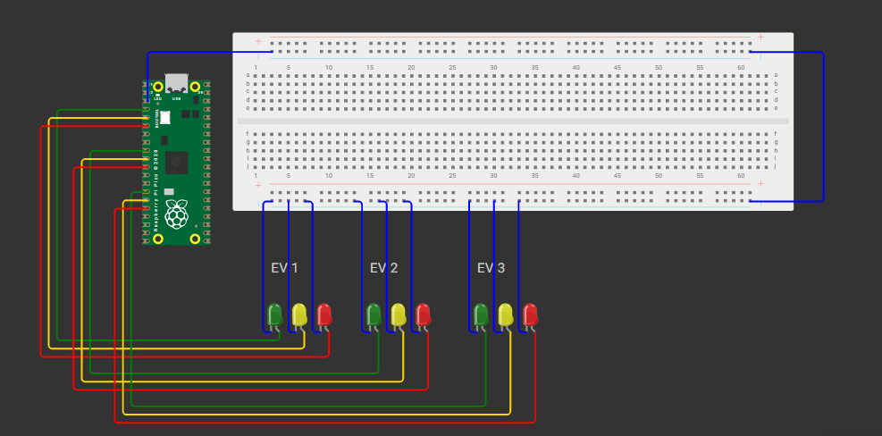

<div align="center">

  <h1>GoodWe Smart Charging Station</h1>
  <h3>Gerenciamento Inteligente de Recarga para Veículos Elétricos</h3>
  <p><b>Sprint 04</b> | Arquitetura de Computadores (1º Ano)</p>

  <!-- Badges de Tecnologia -->
  
  
  
  
  <br><br>

  
  <p><i>Interface do sistema exibindo o gerenciamento de energia e a representação de dados no Monitor Serial.</i></p>

  <h2><a href="https://wokwi.com/projects/476592678358198273">Acesse a Simulação Interativa no Wokwi</a></h2>
</div>

<br>
<hr>

## Índice
- [Sobre o Projeto](#-sobre-o-projeto)
- [Arquitetura do Sistema e Processamento](#-arquitetura-do-sistema-e-processamento)
- [Stack Tecnológico e Hardware](#-stack-tecnológico-e-hardware)
- [Estrutura do Repositório](#-estrutura-do-repositório)
- [Cenários de Simulação](#-cenários-de-simulação-e-gerenciamento)
- [Guia de Execução](#-guia-de-execução-local)
- [Equipe](#-equipe-de-desenvolvimento)

---

## Sobre o Projeto
Este repositório apresenta a **GoodWe Smart Charging Station**, uma simulação educacional inspirada no GoodWe Smart Energy Controller. O sistema utiliza um microcontrolador **Raspberry Pi Pico** para gerenciar de forma inteligente a distribuição de uma quantidade limitada de energia entre múltiplos veículos elétricos (EVs) conectados simultaneamente. 

O projeto evidencia conceitos fundamentais de **Arquitetura de Computadores**, demonstrando na prática o fluxo de entrada, processamento matemático na ULA, armazenamento de estados em memória, conversão de sistemas numéricos (Decimal, Hexadecimal e Binário) e controle de periféricos de saída.

---

## Arquitetura do Sistema e Processamento
O núcleo de tomada de decisão atua balanceando a oferta e a demanda de energia de forma automatizada:

- **Entradas (Input):** Dados simulados de energia total disponível (W), capacidade da bateria (kWh), nível atual da bateria (%) e potência solicitada por cada veículo.
- **Processamento (CPU/ULA):** O algoritmo compara a *Demanda Total* com a *Energia Disponível*. Se houver escassez, a CPU calcula a readequação das cargas, priorizando veículos em fila e calculando os incrementos percentuais na bateria de acordo com os kW entregues.
- **Memória:** Armazenamento volátil dos dicionários contendo os dados e status em tempo real de cada sessão de recarga (EV1, EV2 e EV3).
- **Saídas (Output):** Sinalização visual via LEDs de status e relatórios de telemetria e representação de dados operando no Monitor Serial.

A conversão e representação de dados em baixo nível também são evidenciadas pelo sistema, traduzindo a energia base (ex: 5000 W) para suas formas nativas de processamento:
- **Decimal:** `5000`
- **Hexadecimal:** `0x1388`
- **Binário:** `0b1001110001000`

---

## Stack Tecnológico e Hardware
O protótipo virtual foi implementado e validado utilizando a seguinte arquitetura:

- **Microcontrolador / Processador:** Raspberry Pi Pico
- **Linguagem:** MicroPython
- **Sinalização Visual (Saída):** 9 LEDs (3 Verdes, 3 Amarelos, 3 Vermelhos)
- **Interface de Monitoramento:** Monitor Serial (Console do Wokwi)

---

## Estrutura do Repositório
```text
📦 goodwe-smart-charging
 ┣ 📜 main.py                                  # Algoritmo de gerenciamento e controle de I/O
 ┣ 📜 smart-charging-station.png               # Evidência visual do protótipo e hardware
 ┗ 📜 README.md                                # Documentação técnica do projeto
```
---

## Equipe de Desenvolvimento

<details>
  <summary><b>Clique para expandir a lista de integrantes</b></summary>
  <br>
  <ul>
    <li><b>Leonardo Scotti Tobias</b> (RM: 573305)</li>
    <li><b>Natan Silva da Costa</b> (RM: 573100)</li>
    <li><b>Enzo Seiji Delgado Tabuchi</b> (RM: 573156)</li>
    <li><b>Luca Almeida Lucareli</b> (RM: 569061)</li>
    <li><b>Henrique Almeida Lucareli</b> (RM: 569183)</li>
  </ul>
</details>
